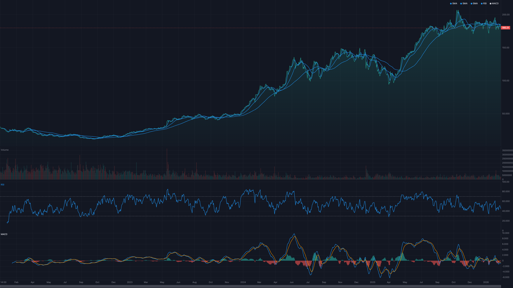
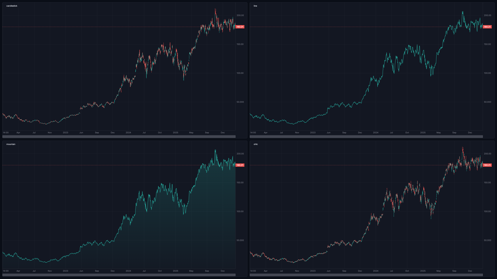
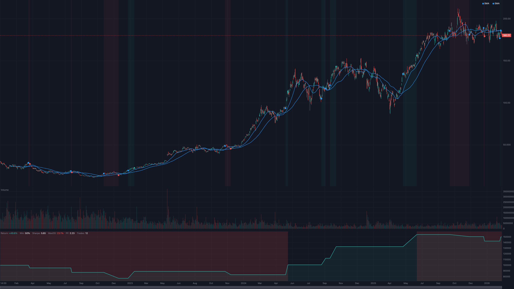
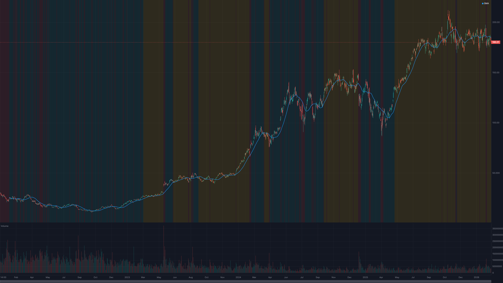

# @trendcraft/chart

Finance-specialized charting library with native [TrendCraft](https://github.com/sawapi/trendcraft) integration. Pass indicator data, get a chart — no manual series decomposition needed.



## Documentation

| Doc | Use it when |
|---|---|
| [GUIDE](./docs/GUIDE.md) | You want the mental model — data model, coordinate system, render loop, theming, viewport, SSR, accessibility |
| [API](./docs/API.md) | You need the full reference — every option, method, type, event |
| [PLUGINS](./docs/PLUGINS.md) | You're writing a custom series renderer or pane primitive |
| [LIVE](./docs/LIVE.md) | You're wiring a real-time feed — WebSocket → `createLiveCandle` → chart |

The rest of this README is a guided tour of the most common features. Reach for the docs above when you need depth.

## Install

```bash
npm install @trendcraft/chart trendcraft
```

**Peer dependencies (all optional):**

| Peer | Required version | When needed |
|---|---|---|
| `trendcraft` | `>=0.2.0` | For indicator auto-detection, `connectIndicators`, `connectLiveFeed`. Chart works without it on plain `{ time, value }[]` data. |
| `react` | `>=19.0.0` | Only when importing from `@trendcraft/chart/react`. |
| `vue` | `>=3.3.0` | Only when importing from `@trendcraft/chart/vue`. |

> The chart's TrendCraft integration relies on `livePresets` / `indicatorPresets` / `createLiveCandle` added in `trendcraft@0.2.0`. Earlier core versions will compile but lose auto-pane-placement and the `connectIndicators` / `connectLiveFeed` presets.

## Quick Start

```typescript
import { createChart } from '@trendcraft/chart';
import { sma, rsi, bollingerBands, ichimoku, macd } from 'trendcraft'; // optional peer dep

const container = document.getElementById('chart');
if (!container) throw new Error('Chart container not found');
const chart = createChart(container, { theme: 'dark' });
chart.setCandles(candles);

// Indicators auto-detect pane placement, colors, and rendering style
chart.addIndicator(sma(candles, { period: 20 }));     // overlay on price chart
chart.addIndicator(bollingerBands(candles));            // bands with fill
chart.addIndicator(ichimoku(candles));                  // cloud with 5 lines
chart.addIndicator(rsi(candles));                       // subchart, 0-100, ref lines 30/70
chart.addIndicator(macd(candles));                      // subchart, histogram + 2 lines
```

No `pane`, `color`, `yRange`, or `label` config needed — the library reads `__meta` from TrendCraft's 130+ indicators.


### Chart Types

Switch between different price rendering styles:

```typescript
const chart = createChart(el, { chartType: 'mountain' }); // or 'candlestick', 'line', 'ohlc'

// Change at runtime
chart.setChartType('line');
```

| Type | Description |
|---|---|
| `candlestick` | OHLC candles with wicks (default) |
| `line` | Close price line |
| `mountain` | Close price with gradient fill |
| `ohlc` | Traditional OHLC bars |



### Without TrendCraft

Works with any `{ time, value }[]` data:

```typescript
const myData = prices.map(p => ({ time: p.timestamp, value: p.close }));
chart.addIndicator(myData, { pane: 'main', color: '#FF9800', label: 'My Line' });
```

## React

Requires **React 19+**.

Two entry points share the same underlying lifecycle: the `<TrendChart>` component for simple drop-in use, and the `useTrendChart` hook for composing the live `ChartInstance` into your own effects.

### Component

```tsx
import { TrendChart } from '@trendcraft/chart/react';
import { sma, rsi } from 'trendcraft';

<TrendChart
  candles={candles}
  indicators={[sma(candles, { period: 20 }), rsi(candles)]}
  backtest={backtestResult}
  theme="dark"
  onCrosshairMove={(data) => console.log(data)}
/>
```

All chart features are available as props: `indicators`, `signals`, `trades`, `drawings`, `timeframes`, `backtest`, `patterns`, `scores`. The underlying `ChartInstance` is reachable via ref.

### Hook

Use the hook when you need imperative access — drawing tools, live feeds, custom plugins, or anything that takes a `ChartInstance` as input. `chart` is `null` before mount and the live instance after, so it drops straight into `useEffect` deps.

```tsx
import { useTrendChart } from '@trendcraft/chart/react';
import { connectIndicators } from '@trendcraft/chart';
import { indicatorPresets } from 'trendcraft';

function MyChart({ candles, liveSource }) {
  const { containerRef, chart } = useTrendChart({ candles, theme: 'dark' });

  useEffect(() => {
    if (!chart) return;
    const conn = connectIndicators(chart, {
      presets: indicatorPresets,
      candles,
      live: liveSource,
    });
    conn.add('rsi');
    chart.setDrawingTool('hline');
    return () => conn.disconnect();
  }, [chart, liveSource]);

  return <div ref={containerRef} style={{ width: '100%', height: 400 }} />;
}
```

## Vue

Requires **Vue 3.3+**.

Same dual API: a `<TrendChart>` component and a `useTrendChart` composable.

### Component

```vue
<script setup>
import { TrendChart } from '@trendcraft/chart/vue';
import { sma, rsi } from 'trendcraft';
</script>

<template>
  <TrendChart
    :candles="candles"
    :indicators="[sma(candles, { period: 20 }), rsi(candles)]"
    :backtest="backtestResult"
    theme="dark"
    @crosshairMove="onCrosshairMove"
  />
</template>
```

### Composable

`chart` is a `ShallowRef<ChartInstance | null>` — do **not** wrap it in `ref()`, which would trigger Vue's deep-reactivity proxy and corrupt the chart's internal state.

```vue
<script setup>
import { watchEffect } from 'vue';
import { useTrendChart } from '@trendcraft/chart/vue';
import { connectIndicators } from '@trendcraft/chart';
import { indicatorPresets } from 'trendcraft';

const { containerRef, chart } = useTrendChart({
  candles: () => props.candles,
  theme: 'dark',
});

watchEffect((onCleanup) => {
  if (!chart.value) return;
  const conn = connectIndicators(chart.value, {
    presets: indicatorPresets,
    candles: props.candles,
  });
  conn.add('rsi');
  onCleanup(() => conn.disconnect());
});
</script>

<template>
  <div ref="containerRef" style="width: 100%; height: 400px" />
</template>
```

Option values accept plain values, refs, or getters — use a getter (`() => props.candles`) to make a prop reactive inside the composable.

## API Reference

### `createChart(container, options?)`

Creates a chart instance attached to a DOM element.

#### Options

| Option | Type | Default | Description |
|---|---|---|---|
| `theme` | `'dark' \| 'light' \| ThemeColors` | `'dark'` | Color theme |
| `width` | `number` | container width | Chart width (px) |
| `height` | `number` | `400` | Chart height (px) |
| `fontSize` | `number` | `11` | Font size (px) |
| `priceAxisWidth` | `number` | `60` | Right axis width (px) |
| `timeAxisHeight` | `number` | `24` | Bottom axis height (px) |
| `priceFormatter` | `(price: number) => string` | auto-precision | Custom price format |
| `timeFormatter` | `(time: number) => string` | smart date/time | Custom time format |
| `watermark` | `string` | — | Background watermark text |
| `legend` | `boolean` | `true` | Show series legend |
| `chartType` | `'candlestick' \| 'line' \| 'mountain' \| 'ohlc'` | `'candlestick'` | Base chart type |

### ChartInstance Methods

#### Data

| Method | Description |
|---|---|
| `setCandles(candles)` | Set OHLCV candle data |
| `updateCandle(candle)` | Update last candle or append new one |
| `batchUpdates(fn)` | Batch multiple mutations into a single render frame |

#### Indicators

| Method | Description |
|---|---|
| `addIndicator(series, config?)` | Add indicator with auto-detection. Returns `SeriesHandle` |
| `getAllSeries()` | Get info for all series (id, pane, type, label, visible) |

#### Signals & Trades

| Method | Description |
|---|---|
| `addSignals(signals)` | Add buy/sell signal markers |
| `addTrades(trades)` | Add trade entry/exit markers with holding period shading |

#### Drawings

| Method | Description |
|---|---|
| `addDrawing(drawing)` | Add a drawing (hline, trendline, fibRetracement) |
| `removeDrawing(id)` | Remove a drawing by id |
| `getDrawings()` | Get all drawings |
| `setDrawingTool(tool)` | Set active drawing tool mode (`null` to disable) |

#### Multi-Timeframe

| Method | Description |
|---|---|
| `addTimeframe(overlay)` | Add higher timeframe candles as semi-transparent overlay |
| `removeTimeframe(id)` | Remove a timeframe overlay |

#### Backtest & Analysis (TrendCraft Integration)

| Method | Description |
|---|---|
| `addBacktest(result)` | Visualize `BacktestResult` — trade markers, equity curve, summary |
| `addPatterns(patterns)` | Draw `PatternSignal[]` — outlines, necklines, targets |
| `addScores(scores)` | Per-bar score heatmap (0=red, 50=yellow, 100=green) |

#### Viewport

| Method | Description |
|---|---|
| `setVisibleRange(start, end)` | Set visible time range |
| `fitContent()` | Fit all candles in view |
| `getVisibleRange()` | Get current visible range (start/end time and index) |
| `setLayout(config)` | Configure multi-pane layout with flex proportions |

#### Events

| Method | Description |
|---|---|
| `on(event, handler)` | Subscribe to chart events |
| `off(event, handler)` | Unsubscribe from chart events |

#### Theme & Export

| Method | Description |
|---|---|
| `setTheme(theme)` | Change color theme |
| `setChartType(type)` | Switch base chart type (candlestick/line/mountain/ohlc) |
| `toImage(type?, quality?)` | Export chart as image `Blob` |
| `resize(width, height)` | Resize chart |
| `destroy()` | Clean up all resources |

#### Plugins

| Method | Description |
|---|---|
| `registerRenderer(plugin)` | Register a custom series renderer plugin |
| `registerPrimitive(plugin)` | Register a pane primitive plugin |

### Keyboard Shortcuts

| Key | Action |
|---|---|
| ← → | Pan left/right (Shift: 10 bars) |
| + / - | Zoom in/out |
| Home / End | Jump to start/end |
| F | Fit all content |

## Series Auto-Detection

The library inspects the first value in a `Series<T>` to determine rendering:

| Value Shape | Rendering | Example |
|---|---|---|
| `number` | Line | SMA, RSI, ATR |
| `{ upper, middle, lower }` | Band with fill | Bollinger Bands, Keltner |
| `{ tenkan, kijun, senkouA, senkouB }` | Ichimoku cloud | Ichimoku |
| `{ macd, signal, histogram }` | Multi-line + histogram | MACD |
| `{ k, d }` | Oscillator lines | Stochastics |
| `{ adx, plusDi, minusDi }` | Multi-line | DMI |
| `{ sar }` | Dot markers | Parabolic SAR |

TrendCraft indicators carry `__meta` with `overlay`, `label`, `yRange`, and `referenceLines` for zero-config pane placement. Custom rules can be added via `SeriesRegistry.addRule()`.

## Drawings

```typescript
chart.addDrawing({ id: 'h1', type: 'hline', price: 150, color: '#FF9800' });

chart.addDrawing({
  id: 'tl1', type: 'trendline',
  startTime: t1, startPrice: 140,
  endTime: t2, endPrice: 160,
});

chart.addDrawing({
  id: 'fib1', type: 'fibRetracement',
  startTime: t1, startPrice: 130,
  endTime: t2, endPrice: 170,
});

chart.removeDrawing('h1');
```

## Backtest Visualization

```typescript
import { runBacktest, goldenCrossCondition, rsiBelow } from 'trendcraft';

const result = runBacktest(candles, goldenCrossCondition(), rsiBelow(70), { capital: 100000 });
chart.addBacktest(result);
// → Trade markers colored by exit reason
// → Equity curve subchart with drawdown shading
// → Summary bar (Return, Win%, Sharpe, MaxDD, PF, Trades)
```



## Pattern Visualization

```typescript
import { doubleTop, headAndShoulders } from 'trendcraft';

chart.addPatterns([...doubleTop(candles), ...headAndShoulders(candles)]);
// → Pattern outlines connecting key points
// → Neckline, target price, pattern name + confidence
```

## Score Heatmap

```typescript
import { rsi } from 'trendcraft';

chart.addScores(rsi(candles));
// → Each candle's background colored by score (red → yellow → green)
```

## Events

```typescript
chart.on('crosshairMove', (data) => {
  // { time, index, ohlcv: { open, high, low, close, volume }, paneId }
});

chart.on('seriesAdded', (data) => { /* { id, label } */ });
chart.on('seriesRemoved', (data) => { /* { id } */ });
chart.on('visibleRangeChange', (data) => { /* { startTime, endTime } */ });
```

## Plugin System

Extend the chart with custom renderers and pane-level overlays.



### Custom Series Renderer

Define a new series type with `defineSeriesRenderer()`:

```typescript
import { defineSeriesRenderer } from '@trendcraft/chart';

const renkoRenderer = defineSeriesRenderer({
  type: 'renko',
  render: ({ ctx, series, timeScale, priceScale, draw }) => {
    // draw.x(index) and draw.y(price) handle coordinate conversion
    for (let i = timeScale.startIndex; i <= timeScale.endIndex; i++) {
      const dp = series.data[i];
      if (!dp) continue;
      // Custom rendering logic...
    }
  },
  priceRange: (series, start, end) => [minPrice, maxPrice], // optional
  formatValue: (series, index) => `${series.data[index]?.value}`, // optional
});

chart.registerRenderer(renkoRenderer);
chart.addIndicator(renkoData, { type: 'renko', pane: 'main' });
```

| Field | Type | Required | Description |
|---|---|---|---|
| `type` | `string` | Yes | Unique type name (must not collide with built-in types) |
| `render` | `(context, config) => void` | Yes | Render the series onto the canvas |
| `priceRange` | `(series, start, end) => [min, max]` | No | Custom Y-axis auto-scaling |
| `formatValue` | `(series, index) => string \| null` | No | Custom tooltip formatting |
| `init` | `() => void` | No | Called once when plugin is registered |
| `destroy` | `() => void` | No | Called on `chart.destroy()` |

### Pane Primitives

Add custom overlays that render below or above series:

```typescript
import { definePrimitive } from '@trendcraft/chart';

const srZones = definePrimitive({
  name: 'srZones',
  pane: 'main',
  zOrder: 'below',
  defaultState: { zones: [{ price: 150, strength: 0.8 }] },
  render: ({ ctx, priceScale, draw }, state) => {
    for (const zone of state.zones) {
      draw.hline(zone.price, { color: `rgba(255,152,0,${zone.strength})` });
    }
  },
});

chart.registerPrimitive(srZones);
```

| Field | Type | Required | Description |
|---|---|---|---|
| `name` | `string` | Yes | Unique identifier |
| `pane` | `string` | Yes | Target pane: `'main'`, a pane id, or `'all'` |
| `zOrder` | `'below' \| 'above'` | Yes | Render order relative to series |
| `render` | `(context, state) => void` | Yes | Render the primitive |
| `defaultState` | `TState` | Yes | Initial state |
| `update` | `(state) => state` | No | Called before each render frame |
| `destroy` | `() => void` | No | Called on `chart.destroy()` |

Both `SeriesRenderContext` and `PrimitiveRenderContext` include a `draw: DrawHelper` object with convenient methods: `x()`, `y()`, `line()`, `hline()`, `vline()`, `circle()`, `rect()`, `polygon()`, `text()`.

## Indicators

Use `connectIndicators` to attach indicators to a chart — with automatic backfill, optional live streaming, and a handle-based API. The interface is duck-typed — no hard `trendcraft` dependency required.

```typescript
import { createChart, connectIndicators, defineIndicator } from '@trendcraft/chart';
import { indicatorPresets } from 'trendcraft';

const chart = createChart(container, { theme: 'dark' });
chart.setCandles(candles);

const conn = connectIndicators(chart, { presets: indicatorPresets, candles });

// Add by preset id (returns an IndicatorHandle)
conn.add('rsi');
const h = conn.add('sma', { period: 20 });
h.setVisible(false);
h.remove();

// Multiple instances of the same preset
conn.add('sma', { period: 5 });
conn.add('sma', { period: 20 });
conn.add('sma', { period: 60 });

// Pre-defined specs are reusable across connections
const sma5 = defineIndicator('sma', { period: 5 });
conn.add(sma5);
```

### Live streaming

Pass a `LiveCandle`-compatible source to stream values in real time. Indicators are back-filled from `candles` + `live.completedCandles`, then updated on each tick:

```typescript
import { createLiveCandle, livePresets } from 'trendcraft';

const live = createLiveCandle({ intervalMs: 60_000, history });
const conn = connectIndicators(chart, {
  presets: livePresets,
  candles: history,
  live,
});
conn.add('rsi');
conn.add('sma', { period: 20 });

// Feed ticks from a WebSocket
ws.on('trade', (t) => live.addTick(t));

conn.disconnect();
```

### Multiple instances of the same preset

`connectIndicators` keys internal state by each instance's `snapshotName`, so dynamic-name presets (`(p) => \`sma${p.period}\``) can be mounted multiple times. For static-name presets (e.g. `emaRibbon`), pass an explicit name:

```typescript
conn.add('emaRibbon', { periods: [8, 13, 21], snapshotName: 'ribbon-short' });
conn.add('emaRibbon', { periods: [34, 55, 89], snapshotName: 'ribbon-long' });
```

### Removing

`remove()` accepts a snapshot name, a preset id (removes all matching), or a handle:

```typescript
conn.remove('sma5');     // single instance (snapshot name match)
conn.remove('sma');      // all sma instances (preset id fallback)
conn.remove(myHandle);   // handle directly
myHandle.remove();       // or via the handle
```

### ConnectIndicatorsOptions

| Option | Type | Default | Description |
|---|---|---|---|
| `presets` | `Record<string, IndicatorPresetEntry>` | `{}` | Indicator preset registry |
| `candles` | `readonly SourceCandle[]` | `[]` | Static candles (static mode / backfill) |
| `live` | `LiveSource` | — | Live data source; enables streaming mode |
| `initHistory` | `boolean` | `true` | Initialize chart with `live.completedCandles` when in live mode |

### IndicatorConnection

| Method / Property | Description |
|---|---|
| `add(presetId, options?)` | Add an indicator. Returns `IndicatorHandle`. |
| `add(spec)` | Add using a pre-defined `IndicatorSpec` from `defineIndicator()`. |
| `remove(target)` | Remove by snapshot name, preset id (all instances), or handle. |
| `list()` | All active handles. |
| `listByPreset(id)` | Handles for a given preset. |
| `get(snapshotName)` | Look up a single handle. |
| `recompute(candles)` | Re-run all indicators with new candle data. |
| `disconnect()` | Unsubscribe events and remove all indicators. |
| `connected` (readonly) | Whether the connection is still active. |
| `mode` (readonly) | `"static"` or `"live"`. |

### IndicatorHandle

| Member | Description |
|---|---|
| `snapshotName` | This instance's unique key (e.g. `"sma5"`). |
| `presetId` | The preset id used to build this instance. |
| `params` | Effective parameters (defaults merged with overrides). |
| `series` | Underlying `SeriesHandle` (escape hatch). |
| `removed` | `true` once removed. |
| `setVisible(visible)` | Toggle visibility. |
| `remove()` | Remove this instance (idempotent). |

Snapshot paths support dot notation: `"bb.upper"` resolves to `snapshot.bb.upper`.

## Headless API

For server-side processing, custom renderers, or testing:

```typescript
import {
  DataLayer, TimeScale, PriceScale, LayoutEngine,
  introspect, autoFormatPrice, lttb,
} from '@trendcraft/chart/headless';

const model = new DataLayer();
model.setCandles(candles);

const result = introspect(myIndicatorData);
// { seriesType: 'band', pane: 'main', rule, preset, yRange, referenceLines }
```

## Troubleshooting

**Chart is blank** — Ensure container has a non-zero height. Set `height` in options or use CSS `height: 100%`.

**Indicator on wrong pane** — Without TrendCraft, number series default to subchart. Use `{ pane: 'main' }` for overlays.

**Performance with large datasets** — The library auto-decimates via LTTB at high zoom levels. 10K+ candles should maintain 60fps.

**Pane won't disappear after removing indicator** — Panes auto-remove when their last series is removed. If using `addTrades`/`addBacktest`, the equity pane persists.

## License

MIT
