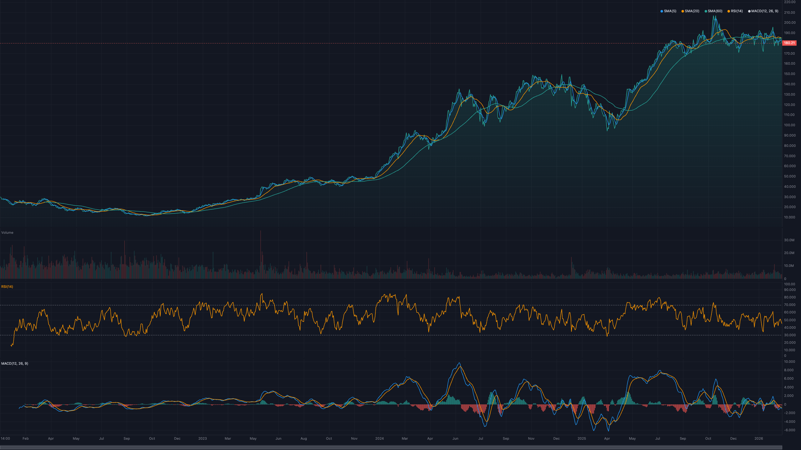
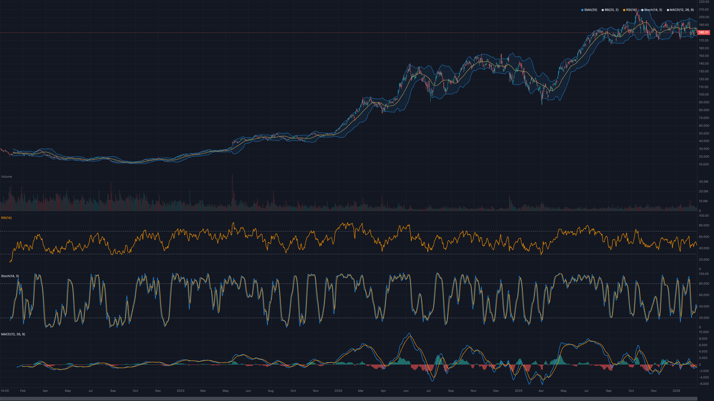

# @trendcraft/chart

A finance-specialized, zero-dependency Canvas charting library with native [TrendCraft](https://github.com/sawapi/trendcraft) `Series<T>` support, framework bindings for React/Vue, and a headless API.



Pass TrendCraft indicator output straight to `addIndicator` and the chart figures out pane placement, colors, value ranges, and rendering style from each indicator's own metadata — no manual series decomposition. It works just as well on plain `{ time, value }[]` data, has no runtime dependencies, and ships React/Vue wrappers plus a DOM-free headless build.

## Install

```bash
npm install @trendcraft/chart trendcraft
```

`trendcraft`, `react`, and `vue` are all **optional** peer deps. The chart runs standalone on plain data; `trendcraft@>=0.3.0` unlocks indicator auto-detection and `connectIndicators`, while `react@>=19` / `vue@>=3.3` are only needed for their respective wrappers.

## Quick start

```typescript
import { createChart } from '@trendcraft/chart';
import { sma, rsi, bollingerBands, macd } from 'trendcraft'; // optional peer dep

const container = document.getElementById('chart');
if (!container) throw new Error('Chart container not found');

const chart = createChart(container, { theme: 'dark' });
chart.setCandles(candles);

// Pane, colors, y-range, and render style are read from each indicator's metadata
chart.addIndicator(sma(candles, { period: 20 })); // overlay line on the price pane
chart.addIndicator(bollingerBands(candles));      // band with fill
chart.addIndicator(rsi(candles));                 // sub-pane, 0–100, 30/70 ref lines
chart.addIndicator(macd(candles));                // sub-pane, histogram + 2 lines
```

Without TrendCraft, pass any `{ time, value }[]` series and a small config: `chart.addIndicator(myData, { pane: 'main', color: '#FF9800', label: 'My Line' })`.



## Highlights

- **Auto-detection** — inspects each `Series<T>` shape (number, band, cloud, MACD, stochastic, DMI, SAR…) plus TrendCraft `__meta` to place and style series with zero config.
- **Core series types** — candlestick, OHLC, line, mountain price rendering, plus band/fill and Ichimoku cloud overlays.
- **Tree-shakeable plugins** — SMC layer, Wyckoff phases, Volume Profile, Market Profile, regime heatmap, price patterns, S/R confluence, squeeze dots, session zones, Andrews pitchfork, trade analysis.
- **Indicator connection** — `connectIndicators` for handle-based add/remove/recompute with optional live streaming.
- **Backtest & analysis** — visualize `BacktestResult` trade markers + equity curve, pattern outlines, and per-bar score heatmaps.
- **Drawings & interaction** — trendlines, h-lines, fib retracement/extension, channels, configurable crosshair magnet modes, and keyboard navigation.
- **React & Vue wrappers** — `<TrendChart>` components plus `useTrendChart` hook/composable for imperative access.
- **Headless API** — DOM-free data layer, scales, layout, and `introspect` for SSR, testing, and custom renderers.
- **Sparkline & replay subpaths** — compact ~4 kB sparklines and a live-feed replay simulator.
- **Bundle-size discipline** — zero runtime dependencies; every entry point is brotli size-checked in CI.

## Framework bindings

```tsx
// React (>=19)
import { TrendChart, useTrendChart } from '@trendcraft/chart/react';
```

```vue
<!-- Vue (>=3.3) -->
<script setup>
import { TrendChart, useTrendChart } from '@trendcraft/chart/vue';
</script>
```

Both expose a `<TrendChart>` component (props: `candles`, `indicators`, `signals`, `trades`, `drawings`, `backtest`, `patterns`, `scores`, `theme`, …) and a `useTrendChart` hook/composable that hands you the live `ChartInstance` for drawing tools, live feeds, and plugins. See the [guide](./docs/GUIDE.md) and [cookbook](./docs/COOKBOOK.md) for full examples.

## Subpath entry points

| Entry | Use |
|---|---|
| `@trendcraft/chart` | `createChart`, `connectIndicators`, plugins, drawing helpers |
| `@trendcraft/chart/headless` | DOM-free `DataLayer`, scales, layout, `introspect`, `lttb` |
| `@trendcraft/chart/react` | `<TrendChart>` component + `useTrendChart` hook |
| `@trendcraft/chart/vue` | `<TrendChart>` component + `useTrendChart` composable |
| `@trendcraft/chart/sparkline` | Vanilla sparkline (also `/react/sparkline`, `/vue/sparkline`) |
| `@trendcraft/chart/replay` | Live-feed replay simulator |
| `@trendcraft/chart/presets` | `registerTrendCraftPresets` for TrendCraft-specific series shapes |

## Documentation

| Doc | Use it when |
|---|---|
| [GUIDE](./docs/GUIDE.md) | You want the mental model — data model, coordinate system, render loop, theming, viewport, SSR, accessibility |
| [API](./docs/API.md) | You need the full reference — every option, method, type, and event |
| [COOKBOOK](./docs/COOKBOOK.md) | You want copy-paste recipes — minimal chart, theming, live data, React/Vue, sparklines, PNG export, headless |
| [PLUGINS](./docs/PLUGINS.md) | You're writing a custom series renderer or pane primitive |
| [LIVE](./docs/LIVE.md) | You're wiring a real-time feed — WebSocket → `createLiveCandle` → chart |

Also published: [`CHANGELOG.md`](./CHANGELOG.md), and machine-readable [`llms.txt`](./llms.txt) / [`llms-full.txt`](./llms-full.txt).

## Disclaimer

`@trendcraft/chart` is a charting library. Its visualizations are derived from technical analysis primitives provided for informational and educational purposes only — they are not investment advice. You are solely responsible for any trading decisions made using this software.

## License

MIT
