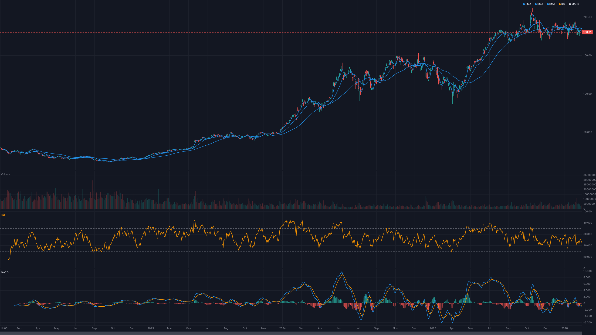
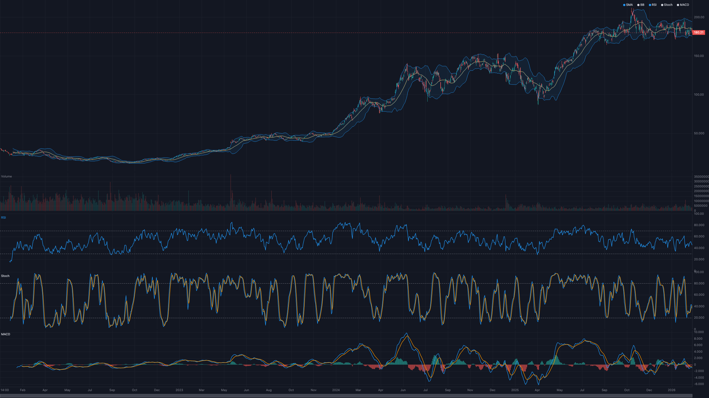

# @trendcraft/chart — Guide

A conceptual walkthrough of `@trendcraft/chart`. If you just want to get pixels on screen, the README's Quick Start is the place to start. This guide is for when you need to understand _why_ the chart behaves the way it does, or you're reaching for a less-common feature.



## Table of Contents

- [What this library is (and isn't)](#what-this-library-is-and-isnt)
- [Data model](#data-model)
- [Coordinate system and scales](#coordinate-system-and-scales)
- [Render loop](#render-loop)
- [Panes and layout](#panes-and-layout)
- [Auto-detection from `__meta`](#auto-detection-from-__meta)
- [Theming](#theming)
- [Viewport and navigation](#viewport-and-navigation)
- [Events](#events)
- [Live data](#live-data)
- [Performance](#performance)
- [SSR and non-browser environments](#ssr-and-non-browser-environments)
- [Accessibility](#accessibility)
- [Cleanup and lifecycle](#cleanup-and-lifecycle)

---

## What this library is (and isn't)

`@trendcraft/chart` is a Canvas-based charting library built specifically for financial time series. It optimizes for three things:

1. **Zero-config indicator rendering** — pass a `trendcraft` indicator output and the chart figures out where it belongs, what scale it needs, and what reference lines to draw.
2. **A small, focused runtime** — no runtime dependencies, ~31 kB gzipped main bundle, one canvas per chart, no virtual DOM.
3. **Extensibility as a plugin system, not a configuration tree** — custom series types and overlays ship as plain functions you register.

What it's **not**:

- Not a general-purpose plotting library. There's no stacked-bar, no 3D, no pie chart. Financial primitives only.
- Not a drop-in replacement for TradingView Lightweight Charts, though the surface is similar. Type names and auto-detection conventions differ.
- Not tied to `trendcraft`. The core accepts `{ time, value }[]` arrays from any source; the `trendcraft` peer just adds nicer defaults.

## Data model

Everything the chart draws is either:

| Kind | Shape | Example |
|---|---|---|
| **Candles** | `{ time, open, high, low, close, volume }[]` | Price data fed via `setCandles()` |
| **Series** | `{ time, value }[]` where `value` is a number, `null`, or an object | Indicators fed via `addIndicator()` |
| **Drawings** | Discriminated union (`hline`, `trendline`, etc.) | User-drawn annotations via `addDrawing()` |
| **Overlays** | Framework-provided helpers (`addSignals`, `addTrades`, `addBacktest`, `addPatterns`, `addScores`) | Pre-baked visualizations of higher-level trading concepts |

`time` is always epoch milliseconds (matches `trendcraft`'s `TimeValue`). `value` shape varies — see [Auto-detection from `__meta`](#auto-detection-from-__meta).

### Compound values

`trendcraft` indicators often return compound objects:

```typescript
rsi(candles)          // [{ time, value: number | null }]
bollingerBands(c)     // [{ time, value: { upper, middle, lower, percentB, bandwidth } }]
ichimoku(c)           // [{ time, value: { tenkan, kijun, senkouA, senkouB, chikou } }]
macd(c)               // [{ time, value: { macd, signal, histogram } }]
```

The chart introspects the first non-null value to pick a series type and pane. You never have to split a compound object into separate line series yourself.

## Coordinate system and scales

Internally, every point goes through two scales:

- **TimeScale** — maps candle **index** (not timestamp) to pixel X. Indices are used so that zooming and panning stay snappy even when timestamps are irregular (weekends, market holidays).
- **PriceScale** — maps price to pixel Y. One price scale per pane, plus an optional left scale for dual-scale panes.

`DrawHelper` (exposed to plugins) wraps these with `draw.x(index)` and `draw.y(price)`.

When you read event data, you get **both** the time value and the pixel coordinate:

```typescript
chart.on('crosshairMove', (data: CrosshairMoveData) => {
  data.time   // epoch ms (or null if outside plot area)
  data.price  // price (or null)
  data.x      // canvas x in CSS pixels
  data.y      // canvas y in CSS pixels
  data.paneId // which pane the pointer is over
});
```

## Render loop

The chart uses a single `requestAnimationFrame` loop. Mutations (`setCandles`, `addIndicator`, viewport changes, etc.) mark the chart dirty; the next frame consumes the dirty state and repaints. You never call `render()` yourself.

Consequences:

- Calling 100 `updateCandle()` in a tight loop costs roughly 1 paint, not 100.
- If you're doing bulk mutations from a batch of WebSocket messages, use `batchUpdates()` to make the dirty-flag bookkeeping explicit:

  ```typescript
  chart.batchUpdates(() => {
    for (const tick of ticks) chart.updateCandle(tick);
    chart.addDrawing(myDrawing);
  });
  ```

- The loop is auto-suspended when the chart is destroyed. `destroy()` is idempotent.

## Panes and layout

A "pane" is a horizontal row with its own price scale. By default the chart has one pane (price) plus an auto-managed volume pane. Indicators with `overlay: false` each get their own pane below.

You rarely configure panes directly. When you do, it looks like this:

```typescript
chart.setLayout({
  panes: [
    { id: 'main', flex: 3 },                          // price pane
    { id: 'volume', flex: 1 },                        // volume pane
    { id: 'rsi', flex: 1, yRange: [0, 100], referenceLines: [30, 70] },
    { id: 'macd', flex: 1 },
  ],
  gap: 4,
  scrollbar: true,
});
```

Panes auto-remove when their last series is removed (except `main` and `volume`, which are sticky).

For dual-scale panes (overlaying two series with incompatible ranges in the same pane), set `leftScale`:

```typescript
chart.setLayout({
  panes: [{
    id: 'main',
    flex: 3,
    leftScale: { mode: 'percent' },  // enables dual-scale
  }],
});
chart.addIndicator(mySecondarySeries, { pane: 'main', scaleId: 'left' });
```

## Auto-detection from `__meta`



When you pass an indicator series to `addIndicator()`, the chart does two things:

1. **Reads `__meta`** if present. `trendcraft` indicators attach a non-enumerable `__meta: SeriesMeta` describing the indicator's domain characteristics (label, overlay vs. sub-pane, Y-range, reference lines). The chart translates these to pane placement.
2. **Falls back to shape introspection.** For untagged data, the chart inspects the first non-null value. A `number` becomes a line, `{ upper, middle, lower }` becomes a band, etc.

This is why you can write `chart.addIndicator(sma(candles))` without passing a pane id — `trendcraft`'s `sma` sets `overlay: true` in its `__meta`, the chart puts it on the price pane, and reads the label for the legend.

### Bypassing auto-detection

Pass a `SeriesConfig` to override:

```typescript
chart.addIndicator(mySeries, {
  pane: 'new',                   // create a new sub-pane
  type: 'histogram',             // force a specific renderer
  color: '#FF9800',
  label: 'My Indicator',
  yRange: [0, 1],
});
```

### Custom introspection rules

If you have custom indicators with a non-standard compound shape, register a rule:

```typescript
import { SeriesRegistry } from '@trendcraft/chart';

SeriesRegistry.addRule({
  name: 'myCustomShape',
  match: (value) => typeof value === 'object' && value !== null && 'score' in value,
  seriesType: 'line',
  channels: ['score'],
});
```

Rules are consulted in registration order, with built-in rules last. Useful when you want to share conventions across a team without each caller configuring the chart.

## Theming

The chart ships with `DARK_THEME` and `LIGHT_THEME`. Both are plain `ThemeColors` objects you can fork:

```typescript
import { createChart, DARK_THEME } from '@trendcraft/chart';

const chart = createChart(container, {
  theme: {
    ...DARK_THEME,
    background: '#0a0e1a',
    upColor: '#00c853',
    downColor: '#d50000',
  },
});

chart.setTheme('light'); // runtime swap
```

Individual series colors are independent of the theme — pass `color` in `SeriesConfig` or set per-channel colors via `channelColors`.

## Viewport and navigation

The time axis has three navigational modes:

| Method | Use case |
|---|---|
| `setVisibleRange(start, end)` | Absolute control — show this time window |
| `setVisibleRangeByDuration('1M')` | Relative — show the last month |
| `fitContent()` | Reset to show everything with 20% right padding |

`fitContent()` locks pan when all data is visible. Once the user zooms back in, pan re-engages.

### Keyboard

The chart captures keyboard when focused:

| Key | Action |
|---|---|
| ← → | Pan (Shift = 10 bars) |
| + / - | Zoom |
| Home / End | Jump to first / last bar |
| F | Fit content |

### Touch

On touch devices: single-finger pan, two-finger pinch-zoom, tap-hold-drag for drawing tools.

## Events

Subscribe via `chart.on(event, handler)`. Unsubscribe via `chart.off`. Events are not typed by the handler — use the data shape hints in `core/types.ts`:

| Event | Payload |
|---|---|
| `crosshairMove` | `CrosshairMoveData` — time, price, x, y, paneId |
| `visibleRangeChange` | `VisibleRangeChangeData` — startTime, endTime, startIndex, endIndex |
| `click` | `CrosshairMoveData` — same as crosshairMove, fires on pointer up |
| `resize` | `{ width, height }` |
| `paneResize` | `{ paneId, height }` — fires when the user drags a pane divider |
| `seriesAdded` | `{ id, label }` |
| `seriesRemoved` | `{ id }` |
| `dataFiltered` | `{ reason, count }` — warnings about invalid candles dropped |
| `drawingComplete` | `Drawing` — fires after a click-to-place drawing finishes |
| `error` | `{ message, source }` — non-fatal runtime warnings |

## Live data

For live feeds, combine `trendcraft`'s `createLiveCandle` with `connectIndicators`. Full walkthrough in [LIVE.md](./LIVE.md).

At a glance:

```typescript
import { createChart, connectIndicators } from '@trendcraft/chart';
import { createLiveCandle, indicatorPresets } from 'trendcraft';

const chart = createChart(el, { theme: 'dark' });
const live = createLiveCandle({ intervalMs: 60_000, history: candles });
const conn = connectIndicators(chart, {
  presets: indicatorPresets,
  candles,
  live,
});
conn.add('rsi');
ws.on('trade', (t) => live.addTick(t));
```

The chart's responsibility is only rendering; the candle aggregation and incremental indicator state live in `trendcraft`.

## Performance

The library targets 60 fps with 10K+ candles out of the box. The mechanisms:

- **LTTB decimation.** Above a threshold, line series are downsampled using [Largest-Triangle-Three-Buckets](https://github.com/sveinn-steinarsson/flot-downsample) to roughly one point per pixel column. Candlesticks are decimated by aggregation (OHLC reduction).
- **Incremental repaints.** Only dirty frames repaint. Crosshair moves repaint a single overlay, not the series layer.
- **Cached tick computation.** Axis labels, pane layouts, and pixel-snapped coordinates are memoized across frames where possible.
- **No per-frame allocation on the hot path.** `DrawHelper` is reused across frames; data points are read via index, not spread.

### Tips for large datasets

- Prefer `updateCandle()` over `setCandles()` for streaming — `setCandles` rebuilds internal caches, `updateCandle` patches them.
- If you're driving from React, pass indicators as stable references (don't recompute every render). The React wrapper compares arrays by reference.
- Use `chart.setVisibleRange()` to constrain rendering to a window when panning backlogs would trigger a full decimation pass.
- For historical backfill with millions of bars, consider feeding only the visible range on `visibleRangeChange` and paging the rest.

## SSR and non-browser environments

The main entry (`@trendcraft/chart`) throws a clear error if called without `document` — `createChart()` refuses to run server-side.

For SSR setups (Next.js, Remix, Astro, Nuxt), use `@trendcraft/chart/headless` on the server and `@trendcraft/chart` on the client. The headless entry exposes:

```typescript
import {
  DataLayer, TimeScale, PriceScale, LayoutEngine,
  introspect, autoFormatPrice, lttb,
} from '@trendcraft/chart/headless';
```

These are the same classes the browser chart uses internally — you can build server-side analytics, static previews, or tests without loading the canvas code.

For Next.js specifically, import `@trendcraft/chart` in a `useEffect` or a dynamic import with `ssr: false`. The React wrapper (`@trendcraft/chart/react`) handles this for you: it mounts in `useLayoutEffect` and skips on the server.

## Accessibility

Each chart mounts an `aria-live` region (`ChartAria`) that announces crosshair updates:

> "RSI: 42.5 at 2026-04-15"

Announcements are debounced to once per 250 ms so screen readers don't get spammed. You can disable ARIA entirely by setting `theme.border` to transparent and... actually you can't disable it yet — if you need that, open an issue.

Keyboard navigation works as documented in [Viewport and navigation](#viewport-and-navigation). The chart container itself is focusable (tabindex 0); arrow keys pan only when focused.

## Cleanup and lifecycle

Always call `destroy()` when unmounting. It:

- Stops the render loop
- Removes all event listeners (including global `resize` / `visibilitychange`)
- Calls `destroy()` on every registered plugin
- Releases the canvas and container references

`destroy()` is idempotent — calling it twice is safe but wastes a function call.

The React and Vue wrappers call `destroy()` automatically on unmount.

For imperative code:

```typescript
const chart = createChart(container, options);
try {
  chart.setCandles(candles);
  // ... use chart ...
} finally {
  chart.destroy();
}
```

Or if you're driving the chart from a longer-lived parent component, keep the instance in a ref and destroy it in the cleanup phase of your framework's lifecycle hook.
